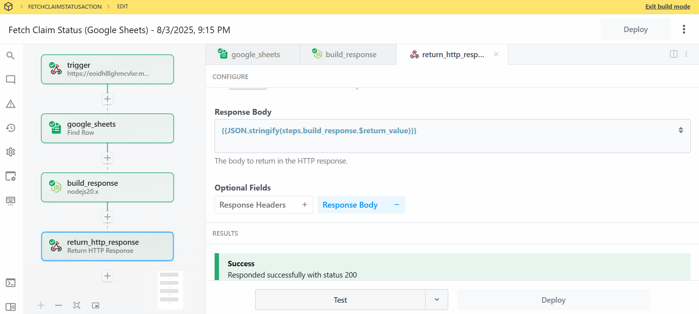
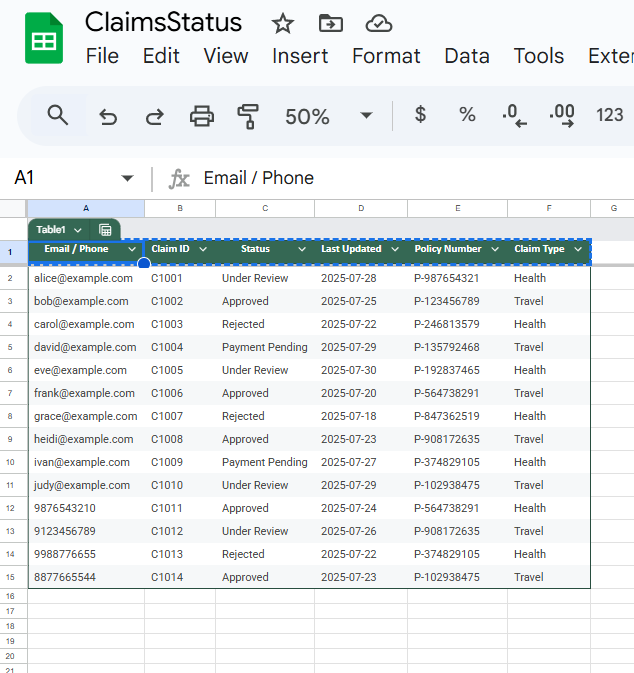

# Backend Logic – SureClaim

## Claim Status Resolution Logic

The agent calculates an estimated resolution timeline based on current claim status.

| Status        | Estimated Resolution               |
|---------------|------------------------------------|
| Under Review  | Expected in 3–5 business days      |
| Approved      | Settled within 2 business days     |
| Rejected      | No further processing expected     |

Logic is applied dynamically after fetching user claim from Google Sheets.

## Workflow Connections

- Inya.ai Agent Action → Pipedream Webhook
- Pipedream Webhook → Fetch claim record from Google Sheets
- JS Logic → Estimate resolution
- Response → Shown to user + optional SMS/email

